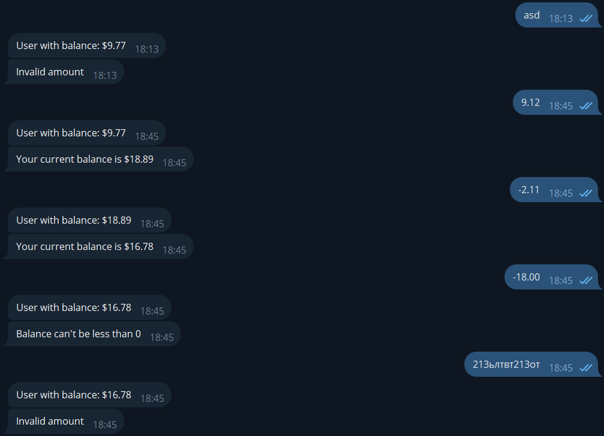
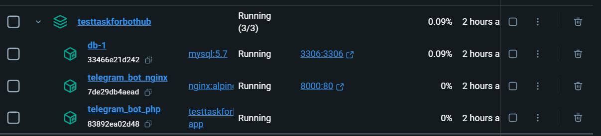

# Тестовое задание для BotHub


## Текст тестового задания
Бот должен обеспечивать следующий функционал:
- когда пользователь пишет боту в первый раз, в базу данных заносится его учётная запись с $0.00 на счёте, при последующих обращениях пользователь должен быть ассоциирован с данной учётной записью;
- если сообщение, которое пользователь отправляет боту, является числом, то соответствующая сумма в долларах начисляется ему на счёт. Если число отрицательное, то сумма наоборот списывается. В ответ пользователю должно отправляться сообщение с остатком на его счёте;
- пользователь может отправить число с отделением дробной части как точкой, так и запятой;
- на счету у пользователя не может быть отрицательной суммы. Если пользователь пытается списать больше, чем у него есть, то в ответ должен получать сообщение об ошибке;
- нужно представить, что работа осуществляется с реальными деньгами, поэтому необходимо принять все меры предосторожности, во избежание коллизий и т. д.

## Описание работы
При выполнении тестового задания было принято решение выполнить его, используя методологию (если быть точным, то набор правил) разработки DDD.
Этот выбор позволяет при необходимости гибко расширять приложение, подстраиваясь под меняющиеся бизнес требования.
Также явным плюсом является то, что можно легко дополнять слой Presentation, что позволяет создавать, к примеру, разнообразные репозитории, которые 
позволят взаимодействовать с разными БД.

При работе с деньгами разделил дробную часть на два целых числа. Это позволит работать с деньгами более точно, и не бояться за ошибки вычислений при работе
с плавающими числами.

Что можно было бы улучшить:
- Вынести баланс пользователя в отдельную сущность (но зависит от бизнеса)
- Добавить транзакции при работе с бд

## Развертывание 

1. Клонируйте репозиторий и перейдите в директорию проекта
    ```bash
    git clone https://github.com/waffflezz/TestTaskForBothub.git
    cd TestTaskForBothub
    ```
2. Создайте бота через [BotFather](https://t.me/BotFather)
3. Создайте и заполните файл `.env`. За основу возьмите `.env.example`
4. Разверните приложение через Docker Compose
    ```bash
    docker compose build
    docker compose up -d
    ```
5. ⚠️ ВАЖНОЕ ⚠️ \
    Бот работает в режиме WebHook. Поэтому для локальной разработки нужно сделать тунелирование. \
    При разработке я использовал [Telebit](https://telebit.cloud/) \
    После того, как сделано тунелирование, можно подключить webhook: \
    > https://api.telegram.org/bot{BotToken}/setWebhook?url={YourAdress}

## Примеры работы
### Пример работы бота

### Запущенные контейнеры

